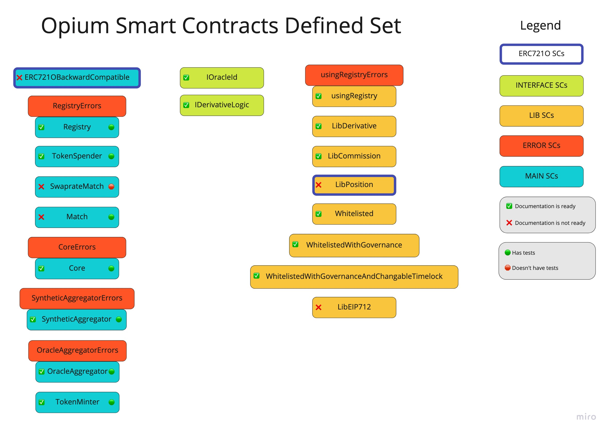

# Opium contracts

## Generated documentation
[DOCS](./docs/index.md)

## Tests

Tests are running against `ganache-cli`

```
    npm run test
```

Because `timeTravel` is used in tests, each run should be running on new `ganache-cli` instance


## Documentation and tests status of Opium contracts

