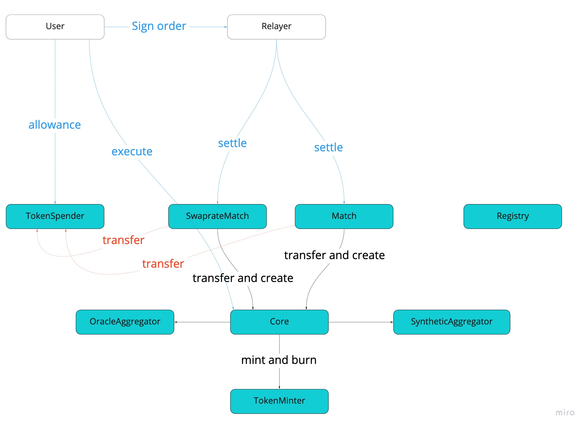
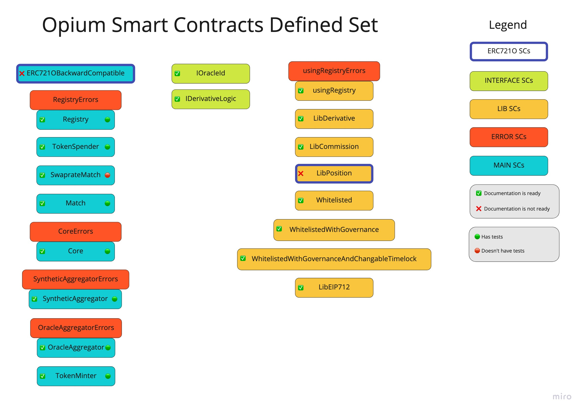

# Opium contracts

[Opium Protocol](https://opium.network) consist of Opium Main Smart Contracts set introduced in this repository alongside with [Opium token standard](https://github.com/OpiumProtocol/erc721o) smart contracts

## Documentation

Protocol documentation can be found here [https://docs.opium.network/](https://docs.opium.network/)

Generated documentation for code can be found [here](./docs/index.md)

## Audit

Protocol was audited by [SmartDec](https://smartdec.net/) and report can be found [here](./docs/audit/OpiumSmartDecSmartContractAudit.pdf)

## Opium protocol is deployed on following addresses

### Mainnet
- LibPosition was deployed at [0x56c54b408c44B12f6c9219C9c73Fcda4E783FC20](https://etherscan.io/address/0x56c54b408c44B12f6c9219C9c73Fcda4E783FC20)
- Registry was deployed at [0xC955F3c0d5a87710996D13B1f9AA3A77552D7a7E](https://etherscan.io/address/0xC955F3c0d5a87710996D13B1f9AA3A77552D7a7E)
- Core was deployed at [0xafDA317cB15967C2fD379885dE227CA236E59Cd3](https://etherscan.io/address/0xafDA317cB15967C2fD379885dE227CA236E59Cd3)
- Match was deployed at [0x6f4b04634A5b334CBCCE569Fa6b5ad597a7a70ea](https://etherscan.io/address/0x6f4b04634A5b334CBCCE569Fa6b5ad597a7a70ea)
- MatchPool was deployed at [0xECc45D06fD4C23F9958a74F254507016b1dfC329](https://etherscan.io/address/0xECc45D06fD4C23F9958a74F254507016b1dfC329)
- SwaprateMatch was deployed at [0x30dc4e9E26F24ACEfA8067e71E1Cd4363a05001E](https://etherscan.io/address/0x30dc4e9E26F24ACEfA8067e71E1Cd4363a05001E)
- TokenSpender was deployed at [0x8bd75f96EfA089aEcf6Ac4CD0B671e2428f4B2af](https://etherscan.io/address/0x8bd75f96EfA089aEcf6Ac4CD0B671e2428f4B2af)
- TokenMinter was deployed at [0x9Dd91d61A7aa58537fCdbf16fD21bE25731341B3](https://etherscan.io/address/0x9Dd91d61A7aa58537fCdbf16fD21bE25731341B3)
- OracleAggregator was deployed at [0xB69890912E40A7849fCA058bb118Cfe7d70932c4](https://etherscan.io/address/0xB69890912E40A7849fCA058bb118Cfe7d70932c4)
- SyntheticAggregator was deployed at [0x3a943C50Bcde3E357916ce6E109626213Fd36105](https://etherscan.io/address/0x3a943C50Bcde3E357916ce6E109626213Fd36105)

### Rinkeby
- LibPosition was deployed at [0xecfb28f107de2bFB325E339293dE3A01C1CfFA74](https://rinkeby.etherscan.io/address/0xecfb28f107de2bFB325E339293dE3A01C1CfFA74)
- Registry was deployed at [0xE665EA43121674964bcd330F65D512e718b7A50b](https://rinkeby.etherscan.io/address/0xE665EA43121674964bcd330F65D512e718b7A50b)
- Core was deployed at [0xE995d8E9E0a01c938e6ae5B05720Af245953dC57](https://rinkeby.etherscan.io/address/0xE995d8E9E0a01c938e6ae5B05720Af245953dC57)
- Match was deployed at [0x00bC68b57dbEdcffe3007890f581f1BE0a2CddaE](https://rinkeby.etherscan.io/address/0x00bC68b57dbEdcffe3007890f581f1BE0a2CddaE)
- MatchPool was deployed at [0x30426CcfAcD4Ac7d552Cd0EAAaE1c0A80056aaa4](https://rinkeby.etherscan.io/address/0x30426CcfAcD4Ac7d552Cd0EAAaE1c0A80056aaa4)
- SwaprateMatch was deployed at [0xC80B660E445d764B7741b59A33818d6526A830B2](https://rinkeby.etherscan.io/address/0xC80B660E445d764B7741b59A33818d6526A830B2)
- TokenSpender was deployed at [0xE39b9D5dC766102181D4C5Cd7df1691565B52032](https://rinkeby.etherscan.io/address/0xE39b9D5dC766102181D4C5Cd7df1691565B52032)
- TokenMinter was deployed at [0xDEe1031c5D64788976E78d78c63C2fd6b411c4ee](https://rinkeby.etherscan.io/address/0xDEe1031c5D64788976E78d78c63C2fd6b411c4ee)
- OracleAggregator was deployed at [0xe1Fd20231512611a5025Dec275464208070B985f](https://rinkeby.etherscan.io/address/0xe1Fd20231512611a5025Dec275464208070B985f)
- SyntheticAggregator was deployed at [0x8Fb660ab5542D752047312443742f209C88E2170](https://rinkeby.etherscan.io/address/0x8Fb660ab5542D752047312443742f209C88E2170)

## High-level flow description of user behavior

1. Users `approve` their ERC20 tokens to `TokenSpender`
2. Users choose orders on relayer frontend, sign them and pass it to relayer
3. Relayer settles matched orders by sending them to `Match` or `SwaprateMatch` contracts depending on `Order` type
4. Matching contracts validate whether all conditions for orders are met, collect margin from buyer and seller, send it to `Core` with position creations command
5. `Core` validates derivative according to `syntheticId` logic, collects margin from Matching contracts and mints position tokens with `TokenMinter`
6. At execution time (maturity) users call core to burn their position tokens and receive payout from derivative

- All smart contracts get each others addresses using `Registry` contract
- Contracts in `contracts/test` folder are mocks and helpers for testing
- `TokenMinter` implements [ERC721O](https://github.com/OpiumProtocol/erc721o)



## Documentation and tests status of Opium contracts (would be updated with additional documentation and tests)


## Tests

Tests are running against `ganache-cli`

```
    npm run test
```

Because `timeTravel` is used in tests, each run should be running on new `ganache-cli` instance

## [LICENSE](./LICENSE.md)

Copyright © 2020 Blockeys BV. All rights reserved.
